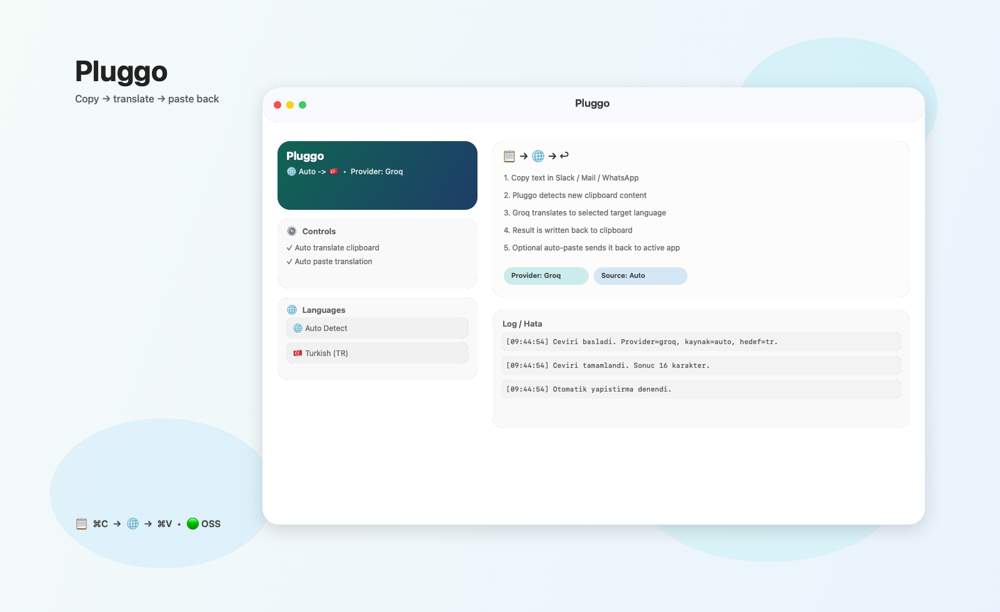

# Pluggo

<p align="center">
  
</p>

Clipboard-first macOS translator for people who don't want to copy text into a separate translation app.

Copy text in any app -> Pluggo translates it automatically -> translated text is written back to the clipboard (and can optionally be pasted back automatically).

<p align="center">
  
</p>

## Features

- Menubar app (`SwiftUI MenuBarExtra`)
- Clipboard watcher (copy -> auto translate)
- Source language + target language selection (`Auto Detect` supported)
- Groq / OpenAI / LibreTranslate providers
- Optional auto-paste back into the active app
- Built-in log panel (copyable logs)
- Turkish-first UX (can be localized later)

## How It Works

1. Choose source/target language and provider.
2. Copy text (`Cmd+C`) in any app.
3. Pluggo detects clipboard change.
4. Pluggo translates the text.
5. Translation is written back to the clipboard.
6. If enabled, Pluggo tries to paste it (`Cmd+V`) into the active app.

## macOS Permissions

Pluggo may need:

- `Accessibility` permission (for auto-paste)
- Clipboard access (macOS may prompt depending on app/context)

Detailed steps: [`docs/permissions.md`](docs/permissions.md)

## Privacy Notes

- Translated text is sent to the selected provider (`Groq`, `OpenAI`, or `LibreTranslate`).
- If you use a public LibreTranslate instance, your text goes to that server.
- API keys are currently stored in `UserDefaults` (planned improvement: optional Keychain mode).

## Run From Source (Dev)

```bash
swift run
```

## Build a macOS App (`.app`)

Creates a local app bundle in `dist/Pluggo.app`.

```bash
./build.sh --no-dmg
```

## Build a DMG (Release Artifact)

Creates `dist/Pluggo-<version>.dmg`.

```bash
VERSION=0.1.0 ./build.sh
```

## Project Structure

- `Sources/PluginnApp/` -> app source code
- `Packaging/` -> app bundle metadata (`Info.plist`)
- `docs/` -> documentation / screenshots / permissions
- `.github/workflows/` -> CI + release automation
- `build.sh` -> builds `.app` and optional `.dmg`

## Open Source Setup (Suggested)

1. Create a GitHub repo and push this project.
2. Add a tag like `v0.1.0`.
3. GitHub Actions release workflow builds and uploads the DMG.

## Roadmap

- Keychain storage for API keys (optional mode)
- Global shortcut trigger mode
- Language pair presets / auto-direction for chat use
- Better packaging (codesign + notarization)
- Localization (TR/EN UI)

## Contributing

See [`CONTRIBUTING.md`](CONTRIBUTING.md).

## License

MIT - see [`LICENSE`](LICENSE)
